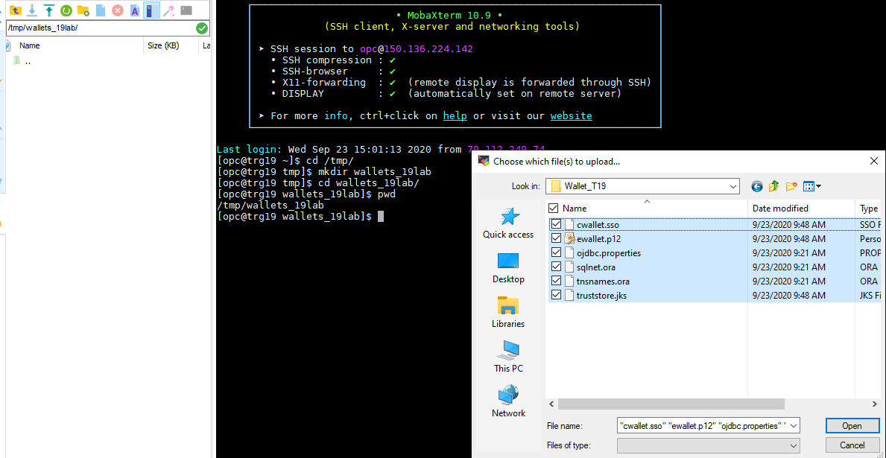
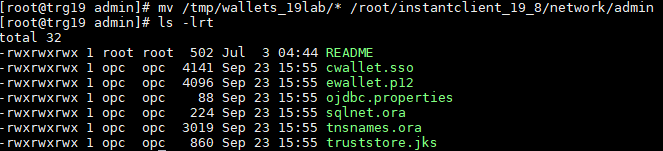
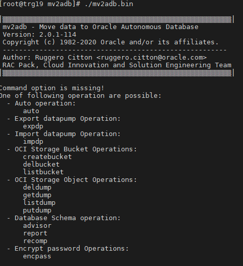
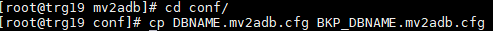

# Consolidate your databases using MV2ADB

## Table of contents


<!--
How to add to TOC
* [DisplayName](#createdtag)
  * [DisplaynameUnder](#createdtag)

How to create a tag (put this above your  ## Header)
<a name="createdtag"></a>
-->


<!--
<a name="closing"></a>
## Closing statement
-->

<a name="intro"></a>
## Introduction
Move to Autonomous Database (MV2ADB) is a tool, which migrates data from an "on premises" database to Autonomous Database Cloud utitlizing Oracle Data Pump. Data Pump lets you Import your data into Autonomous Database using Data Pump Dump Files which are residing on Oracle Cloud Infrastructure Object Storage.
The MV2ADB tool is able to automatically take a data pump export, push it to OCI Object Storage, then it automatically imports it into the Autonomous Database using Data Pump in one command.
*Note: For using mv2adb for migration from source DB to ATPD, the source DB should be at lower version than Autonomous Database.*


<a name="obj"></a>
### Objectives
As a admin/root user
1. Establish connectivity from Source instance to Target instance.
2. Install and Configure MV2ADB tool on Source.
3. Run the MV2ADB config script to migrate workloads from Source to Target.

<a name="assumptions"></a>
### Assumptions for this lab, ***please copy our assumptions***
* The ***SOURCE DATABASES*** used are **11.2** and **19C**
  * The schemas used are as follow:
    * 11g - MARKET
    * 19c - HR
  * This lab was not tested for other versions other than 11.2 and 19c
  * The source database must be a lower version than the Autonomous database
* An Autonomous database (target) provisioned
* Source databases provisioned
* The source databases must have internet connectivity
* The source servers are running Oracle Linux
* Access to an OCI tenancy
  * Ability to create buckets
  * Ability to create an authentication token (steps below)


**Downloading/Generating**
  <a name="downloadwallet"></a>
* **Download the Autonomous Database wallet**
  * Go to your Autonomous Database and click on “DB Connection”.

  * Click on Download wallet.


 * Create a password for the wallet.


  * Click on Download.


<a name="authtoken"></a>
* **Generate a auth token (Note this down!)**

  * Click on your profile, then your username


  * Click on Auth Token, and click Generate (**Note it down as you will not be able to see it again!**)


<a name="makebucket"></a>
## Creating a Bucket

* Login to your tenancy.
* Click on the menu in top left.
* Select Object Storage.


* Make sure you are in the right compartment.
* Click "Create Bucket".


* Set your name, then hit Create Bucket again.
* Take note of your region, bucket name, and tenancy name for later.


<a name="instantclient"></a>
## Installing Instant Client on the Source Servers
#### The same installation steps for all versions of Oracle database
* Connect to the source databases, and switch to the ***root*** user.
```
ssh -i <private-key> opc@PublicIP
sudo su - root
```
* Navigate to the home directory of the root user.
* Click [here](https://www.oracle.com/database/technologies/instant-client/linux-x86-64-downloads.html) and find your SOURCE database version.
* Download the **basic package, tools, and development packages** ***ZIP FILES.***
* Right click on the link under the download column, then click on **copy link address**


* Copy the links for all three ***ZIP FILES*** and put in a notepad
* Fill out the following (links are for 19C, replace with yours if needed)
* Run the following commands on the home directory of the root user
```
wget https://download.oracle.com/otn_software/linux/instantclient/19800/instantclient-basic-linux.x64-19.8.0.0.0dbru.zip
wget https://download.oracle.com/otn_software/linux/instantclient/19800/instantclient-sqlplus-linux.x64-19.8.0.0.0dbru.zip
wget https://download.oracle.com/otn_software/linux/instantclient/19800/instantclient-tools-linux.x64-19.8.0.0.0dbru.zip
```


* Unzip the files.
```
unzip -o instantclient-basic-linux.x64-19.8.0.0.0dbru.zip
unzip -o instantclient-sqlplus-linux.x64-19.8.0.0.0dbru.zip
unzip -o instantclient-tools-linux.x64-19.8.0.0.0dbru.zip
```
* After the files are unzipped, navigate inside the directory named instantclient_yourversion
* Verify you have sqlplus, expdp, and impdp in the .
```
cd instantclient_19_8
ls -lrta
```


<a name="instantwallet"></a>
### Adding your wallet to the instant client

* We're going to use the wallet ZIP file you should have grabbed from the start.
* On Windows, you will need to use a tool to sftp the files to your source instance.
  * Popular ones are WinSCP, and Mobaxterm.
  * I will be using Mobaxterm's built in sftp.
* CD into your instantclient_19_8/network/admin folder on your source instance.
* Run the following on your source instance.
  * Note, we switch to the ***opc*** user because we will not have permission for the root folder.
```
sudo su - opc
cd /tmp/
Mkdir -m 777 wallets_19lab
Cd wallets_19lab
```


* Now, open up your sftp tab on your Mobaxterm
  * It's the same process for WinSCP, you just login as opc and upload through that gui.
  * You can also upload the wallet zip file somewhere, and just use the wget command.


* Now, unzip all the files
```
unzip Wallet_T19.zip
chmod 777 *
ls -lrta
```


* Now, switch back to root by typing exit and then move the contents However.
```
exit
mv /tmp/wallets_19lab/* /root/instantclient_19_8/network/admin
```

* ***NOTE -: LEAVE THE ZIP FILE IN THIS FOLDER AS WELL!***

<a name="connectivitytest"></a>
## Testing connectivity from source to target
* First, we need to grab our connect string from the tnsnames.ora that we just unzipped.
* We will then just grab the name and note it down, refer to the screenshot.
```
cd /root/instantclient_19_8/network/admin
cat tnsnames.ora
```


* Next, we need to export some parameters as aliases.
* Just run these on the Linux command line.
* ***Make sure your ORACLE_HOME matches your instantclient folder.***
```
export ORACLE_HOME=/root/instantclient_19_8
export LD_LIBRARY_PATH="$ORACLE_HOME"
export PATH="$ORACLE_HOME:$PATH"
```


* Now, we can test sqlplus connectivity.
* Refer to your tnsnames.ora if needed.
```
cd /root/instantclient_19_8
./sqlplus ADMIN/WElcome_123#@t19_high
```


<a name="mv2adb"></a>
## Download and Install MV2ADB on Source DBCS instance
##### Steps are the same for all Database versions, but make sure to grab the right RPM version from the link below
* Download the MV2ADB rpm file [here](https://support.oracle.com/epmos/faces/DocContentDisplay?_afrLoop=291097898074822&id=2463574.1&_afrWindowMode=0&_adf.ctrl-state=v0102jx12_4). Platform specific rpm can be downloaded under the History Tab.

* Transfer this file to your Source DBCS using Mobaxterm or similar.
  * Refer above for steps


* Install the rpm using the given command from the directory where the rpm exists.
```
rpm -i mv2adb-2.0.1-114.el6.x86_64.rpm
```


<a name="encrypt"></a>
## Encrypting passwords, and your authentication token
Once you install the RPM, a folder will be created called **/opt/mv2adb**. We are going to use this tool to encrypt our **DATABASE** password, and our authentication token you got from the start of the lab.
* Take note of your authentication token, and your password and then run the commands below. It will output a long string, **this is your encrypted password so save it for later!**
* You cannot see the password you enter, this is normal!
```
cd d /opt/mv2adb
./mv2adb.bin encpass
```

* **SAVE THE STRING!!!**
* Note -: ***If you get an error saying it cannot find the command or similar***, you may have to run the mv2adb.bin without any parameters to first initialize it!
```
./mv2adb.bin
```


<a name="config"></a>
## Setting up the configuration file
***NOTE -: ALL PASSWORDS (AND THE AUTH TOKEN FOR THE BUCKET) USE THE ENCRYPTED FORMAT STRING***
* First, take a backup of the original configuration file.
```
cd conf/
cp DBNAME.mv2adb.cfg BKP_DBNAME.mv2adb.cfg
```



* Now, edit the configuration file.
* You only need to edit these, **comment out the rest!**
```
DB_CONSTRING =//<hostname>/<servicename of DB>
SYSTEM_DB_PASSWORD=<enc_password>
SCHEMAS=<schemas to be migrated>
REMAP=<Source tablespace>:<Target tablespace>
DUMP_NAME=<name for your dump file>
DUMP_PATH=<path to store your dump file>
DUMP_FILES=<full path of dump file>
OHOME=<Oracle Home Path>
ICHOME=<Instant Client Path>
```

<a name="dbcon"></a>
### How to find your DB_CONSTRING
##### Hostname
* Go to your **SOURCE INSTANCE** and login as the **ORACLE USER!**
* Then, set your environment to your **SOURCE DATABASE.**
* Then, check your listener, refer to command below.
```
. oraenv
lsnrctl status
```

* Your **HOSTNAME** will be under the "Listening Endpoints Summary", refer to screenshot
* In our case, it is 10.9.1.33!

##### Service name
* You simply grab it from the **SOURCE DATABASE** tnsnames.ora.
```
cat $ORACLE_HOME/network/admin/tnsnames.ora
```


##### Now, test and see if it can connect to your SOURCE DATABASE.
* Connect your hostname and your service name, refer to my example below if you need help.
```
sqlplus SYS/WElcome_123#@//10.9.1.33/trg.sub02201203420.autonomouscmpvc.oraclevcn.com as sysdba
```


<a name="adbprop"></a>
### Filling out your ADB Properties
These are the following parameters we will talk about in this section.
```
ADB_NAME=
ADB_PASSWORD=
ADB_CFILE=
```
##### ADB_NAME
This is just going to be the connect string name from your Autonomous tnsnames.ora (from your credentials ZIP file). ***You do not need to add _high, it will add it automatically so DO NOT ADD IT!***

##### ADB_PASSWORD
This is your Autonomous database password in the **ENCRYPTED** format from earlier steps.

##### ADB_CFILE
This is the location of your wallet ZIP file location, in my case it was -:
```
/root/instantclient_19_8/network/admin/Wallet_T19.zip
```
If you don't have your ZIP, just sftp to your network/admin folder.

<a name="adbprop"></a>
### Filling out your Object Store Properties
Some of these are self explanatory
```
OCI_REGION=
OCI_NAMESPACE=
OCI_BUCKET=
OCI_ID=
OCI_PASSWORD=                       
```
##### OCI_NAMESPACE
This is your tenancy name

##### OCI_ID
This is your login username. Make sure to include your oracleidentitycloudservice if using SSO / Federation.
```
e.g.
oracleidentitycloudservice/noah.horner@oracle.com
```

##### OCI_PASSWORD
This is your **ENCRYPTED** authentication token from earlier on in the lab.

<a name="screenconfig"></a>
### Screenshot of an example configuration file


<a name="migscript"></a>
## Running the Migration Script
Now we are going to run the script that exports from your source, then imports into your Autonomous database using data pump. You can always refer to the official steps from my Oracle support (MOS) [here](https://support.oracle.com/epmos/faces/DocContentDisplay?_afrLoop=291097898074822&id=2463574.1&_afrWindowMode=0&_adf.ctrl-state=v0102jx12_4).

* We will run it in AUTO mode, follow the command. ***MAKE SURE YOU ARE THE ROOT USER***
```
cd /opt/mv2adb
./mv2adb.bin auto -conf /opt/mv2adb/conf/DBNAME.mv2adb.cfg
```


* Once it is done, you will see this.
* You may get an error about DBA role grants. This error is okay, please refer to [here](https://docs.oracle.com/en/cloud/paas/exadata-express-cloud/mgeec/import-schema-oracle-autonomous-database-1.html).


<a name="validate"></a>
## Validate the Data Migration
We used HR schema, but make sure you check the correct schema you used from your configuration file. If you followed lab 7, HR should be there.

```
cd /root/instantclient_19_8/
./sqlplus ADMIN/WElcome_123#@t19_high
select TABLE_NAME from all_tables where owner='HR';
```


<a name="troubleshooting"></a>
## Troubleshooting Common Issues
<a name="dump"></a>
**Dump File errors**
* After each run, make sure to clear out the dump file directory.
```rm /home/oracle/dpump/* ```


<a name="accountlocked"></a>
**Account Locked error**
* Switch to Oracle user, set environment (.oraenv), and unlock.
* The following commands will show you all users that are locked, and how to unlock a user.
```
sqlplus / as sysdba
SELECT username, account_status, created, lock_date, expiry_date FROM dba_users WHERE account_status != 'OPEN';
ALTER USER username ACCOUNT UNLOCK
```

<a name="cannotopenlogfile"></a>
**Cannot Open Logfile**
* We need to change directory group from root to oninstall and change permissions.
```
chown oracle:oinstall /home/oracle/dpump
chmod -R 660 /home/oracle/dpump
```


<a name="wrongpassword"></a>
**Wrong password when connecting**
*  Double check you encrypted the right database password and auth token from OCI. You can regenerate them and use the new ones to make sure.

<a name="alotoferrors"></a>
**Getting a crazy amount of errors**
* You probably had FULL = Y **NOT commented out in your config file!***   


<a name="closing"></a>
## Closing statement

- **Author** - Noah Horner & Humza Meraj
- **Last Updated By/Date** - Noah Horner & Humza Meraj September 28th, 2020.
