# Migrate Workloads to ATP-D using MV2ADB
## Introduction
Move to Autonomous Database (MV2ADB) is a tool, which migrates data from an "on premises" database to Autonomous Database Cloud utilizing Oracle Data Pump. Data Pump lets you Import your data into Autonomous Database using Data Pump Dump Files which are residing on Oracle Cloud Infrastructure Object Storage.
The MV2ADB tool is able to automatically take a data pump export, push it to OCI Object Storage, then it automatically imports it into the Autonomous Database using Data Pump in one command.
*Note: For using mv2adb for migration from source DB to ATPD, the source DB should be at lower version than Autonomous Database.*


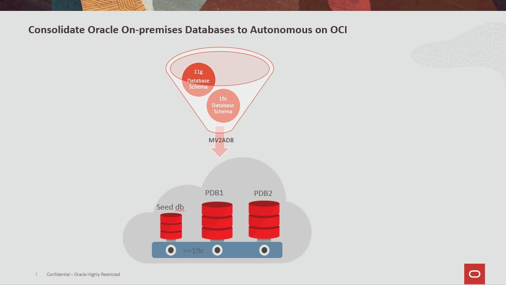


### Objectives
As a root user
1. Establish connectivity from source database instances to Target instance.
2. Install and configure MV2ADB tool on source databases.
3. Run the MV2ADB config script to migrate the databases from Source to Target.

### Required Artifacts
- A pre-provisioned dedicated autonomous database instance.
- Two pre-provisioned Source databases, one 19c and one 11g.
- ATP-D Wallet downloaded on your local machine.
- A pre-generated Auth Token from the console.

<!--
### Assumptions for this lab, ***please copy our assumptions***
* The ***SOURCE DATABASES*** used are **11.2** and **19C**
  * The schemas used are as follow:
    * 11g - MARKET
    * 19c - HR
  * This lab was not tested for other versions other than 11.2 and 19c
  * The source database must be a lower version than the Autonomous database
* An Autonomous database (target) provisioned
* Source databases provisioned
* The source databases must have internet connectivity
* The source servers are running Oracle Linux
* Access to an OCI tenancy
  * Ability to create buckets
  * Ability to create an authentication token (steps below)
!-->


## STEP 1: Downloading ATP-D wallet to your local machine


- Go to your Autonomous Database and click on “DB Connection”.

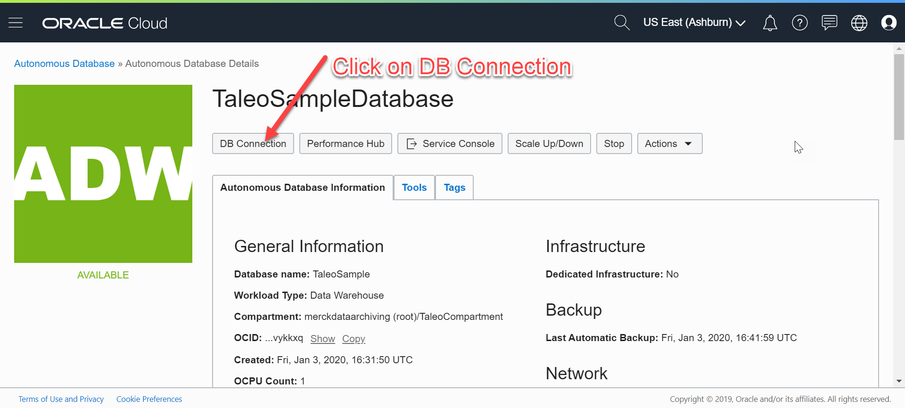

- Click on Download wallet.

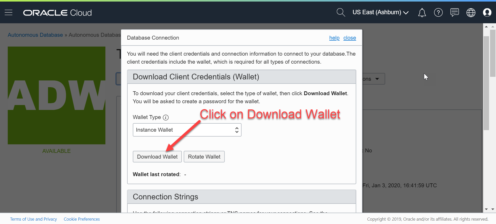

- Create a password for the wallet.

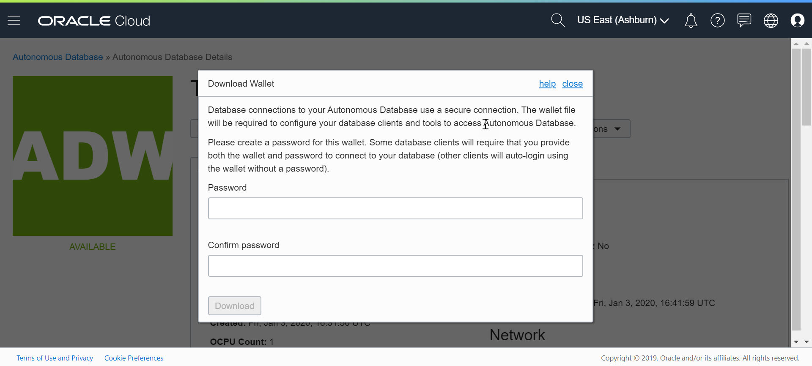

-  Click on Download.

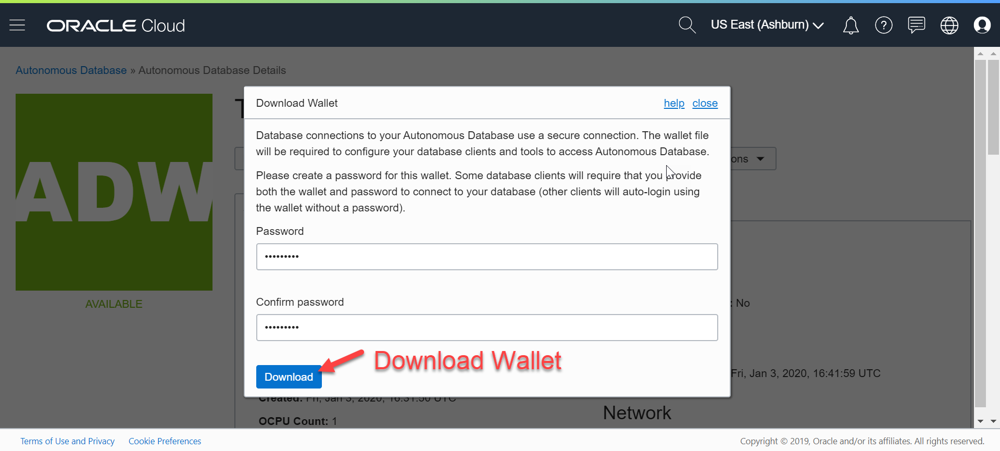


## STEP 2: Generating an Auth Token and creating a bucket
##### Generating an Auth Token
- Click on your profile, then your username

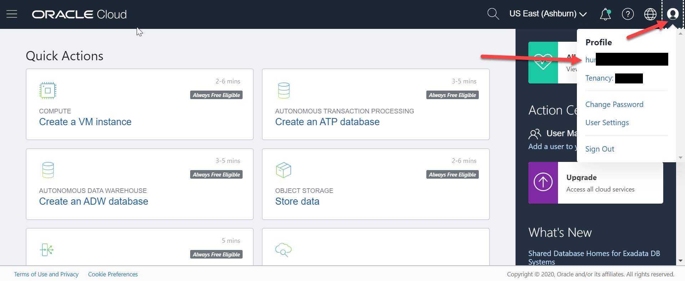

- Click on Auth Token, and click Generate

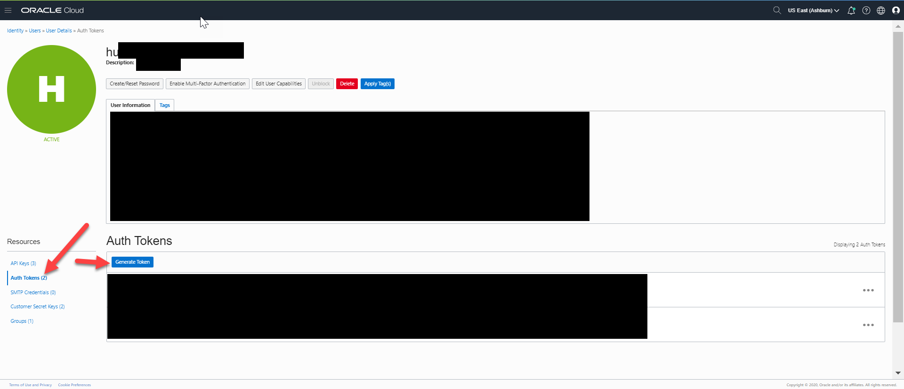
*Note: Copy your Auth Token to a notepad, as you cannot see it once you close the window.*


##### Creating a Bucket

- Login to your tenancy.
- Click on the menu in top left.
- Select Object Storage.

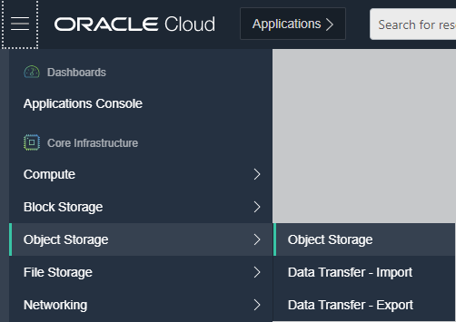

- Make sure you are in the right compartment.
- Click "Create Bucket".

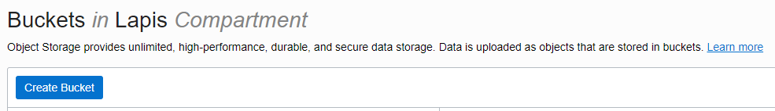

- Set your name, then hit Create Bucket again.

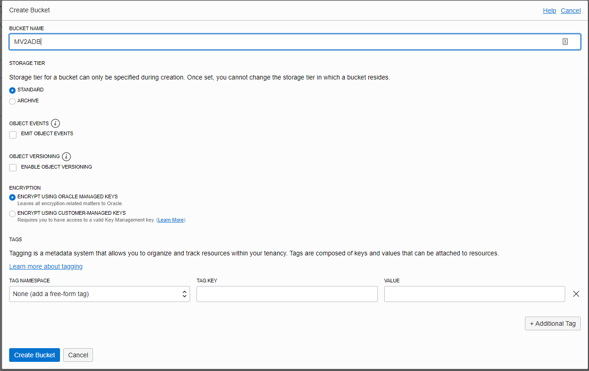
*Take note of your region, bucket name, and tenancy name for later.*


## STEP 3: Installing Instance Client on the Source database instances

- Navigate [here](https://www.oracle.com/database/technologies/instant-client/linux-x86-64-downloads.html) to find the links for the most recent instant client.
<!-- HUMZA DONE!-->
* Copy the file links of the following Instant Client packages by right clicking and selecting "Copy Link Address". Paste each one on your preferred text editor.
  * Basic Package (ZIP)
  * SQL*Plus Package (ZIP)
  * Tools Package (ZIP)
  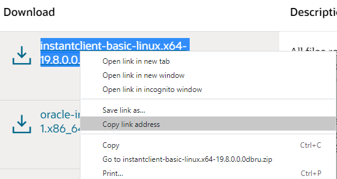
* Add "wget" in front of each copied link.
  * Example:
  ```
  wget https://download.oracle.com/otn_software/linux/instantclient/19800/instantclient-basic-linux.x64-19.8.0.0.0dbru.zip
  wget https://download.oracle.com/otn_software/linux/instantclient/19800/instantclient-sqlplus-linux.x64-19.8.0.0.0dbru.zip
  wget https://download.oracle.com/otn_software/linux/instantclient/19800/instantclient-tools-linux.x64-19.8.0.0.0dbru.zip
  ```


- Connect to both Source database instances, and switch to the ***root*** user.
```
ssh -i <private-key> opc@PublicIP
sudo su - root
```


<!-- HUMZA DONE !-->
- Run the "wget" commands that were created above on the root home directory on both Source database instances.
```
wget https://download.oracle.com/otn_software/linux/instantclient/19800/instantclient-basic-linux.x64-19.8.0.0.0dbru.zip
wget https://download.oracle.com/otn_software/linux/instantclient/19800/instantclient-sqlplus-linux.x64-19.8.0.0.0dbru.zip
wget https://download.oracle.com/otn_software/linux/instantclient/19800/instantclient-tools-linux.x64-19.8.0.0.0dbru.zip
```


- Unzip the files on both Source database instances.
```
unzip -o instantclient-basic-linux.x64-19.8.0.0.0dbru.zip
unzip -o instantclient-sqlplus-linux.x64-19.8.0.0.0dbru.zip
unzip -o instantclient-tools-linux.x64-19.8.0.0.0dbru.zip
```


- Navigate inside the directory named instantclient_yourversion on both Source database instances.
- Verify you have sqlplus, expdp, and impdp inside the directory on both Source database instances.
```
cd instantclient_19_8
ls -lrta
```
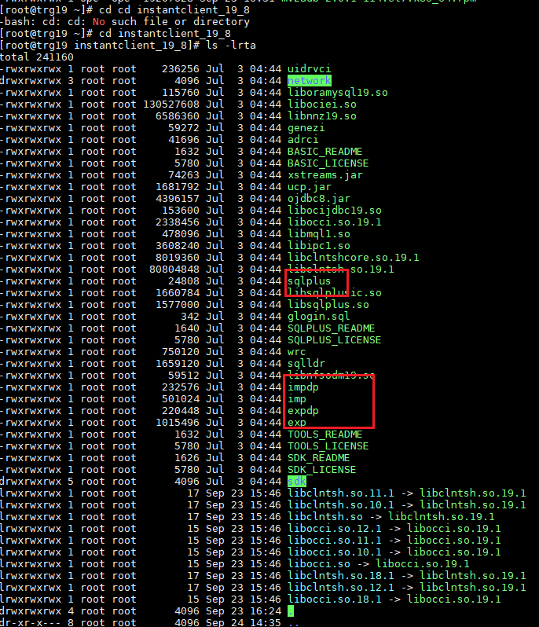


## STEP 4: Transferring the ATP-D wallet on your local machine to both Source database instances
- Using your preferred sftp client, connect to both Source database instances as opc user.
- Navigate to the /tmp/ folder on both Source database instances via the sftp client
- Upload the ATP-D wallet from your local machine to both Source database instances.
- Exit the sftp client on your local machine.
```
sudo su - opc
cd /tmp/
Mkdir -m 777 wallets_19lab
Cd wallets_19lab
```


- On both Source database instances, connect as root and navigate to /root/instantclient_yourversion/network/admin.
- Move the ATP-D wallet from the /tmp/ directory to the /root/instantclient_yourversion/network/admin/ directory on both Source database instances.
- Unzip the ATP-D wallet inside the directory on both Source database instances.
```
mv /tmp/Wallet_T19.zip /root/instantclient_19_8/network/admin/
unzip Wallet_T19.zip
```
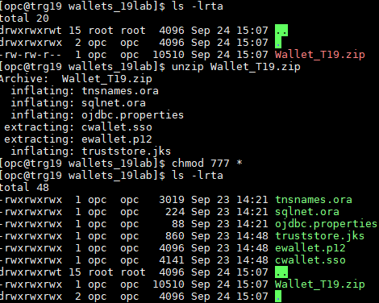


## STEP 5: Verifying both Source database instances can connect to the ATP-D database
- View the connect string via the tnsnames.ora from the ATP-D wallet on both Source database instances.
```
cd /root/instantclient_19_8/network/admin
cat tnsnames.ora
```
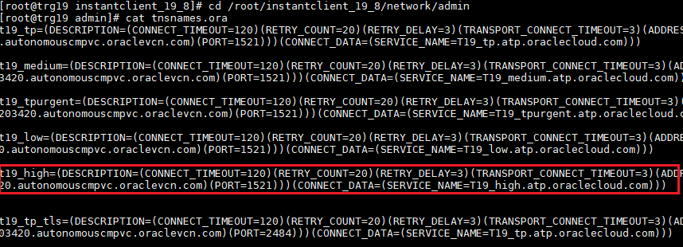
  *Note: Both 11g and 19c Source databases are being consolidated into one ATP-D database, so the connect string will be the same for both Source database instances.*


- Export instant client paths on both Source database instances.
```
export ORACLE_HOME=/root/instantclient_19_8
export LD_LIBRARY_PATH="$ORACLE_HOME"
export PATH="$ORACLE_HOME:$PATH"
```
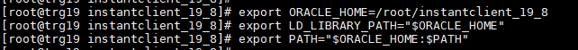

 *Note: The ORACLE_HOME path may vary depending on your instant client version*


- Navigate to the base instant client directory on both Source database instances.
- Test connectivity to the Target database from both Source database instances.
```
cd /root/instantclient_19_8
./sqlplus ADMIN/DATABASEPASSWORD@t19_high
```
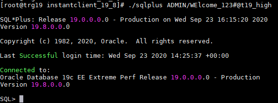


## STEP 6: Download and Install MV2ADB on both Source database instances.
- On your local machine, download the MV2ADB rpm file [here](https://support.oracle.com/epmos/faces/DocContentDisplay?_afrLoop=291097898074822&id=2463574.1&_afrWindowMode=0&_adf.ctrl-state=v0102jx12_4). Platform specific rpm can be downloaded under the History Tab.

  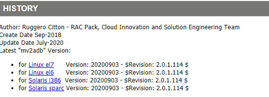


- Using your preferred sftp client, connect to both Source database instances as opc user.
- Navigate to the /tmp/ folder on both Source database instances via the sftp client.
- Upload the MV2ADB rpm file from your local machine to both Source database instances.
- Exit the sftp client on your local machine.
- Connect as root and navigate to /tmp/ on both Source database instances.
- Install the RPM on both Source database instances.
```
rpm -i mv2adb-2.0.1-114.el6.x86_64.rpm
```
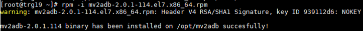


- Verify installation was successful on both Source database instances.
```
ls -lrta /opt/mv2adb
```
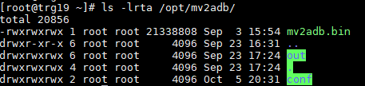


## STEP 7: Encrypt passwords of both Source database instances, Target database, and Auth Token.
- Encrypt to following passwords using the “mv2adb encpass” command, and save the values to a safe location (Eg: Notepad).
  - Both Source database SYS passwords.
  - ADMIN password of the Target database.
  - Auth Token.
```
cd /opt/mv2adb
./mv2adb.bin encpass
```
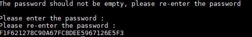

  *Note -: If you get an error saying it cannot find the command, you may have to run the mv2adb.bin without any parameters to first initialize it! (./mv2adb.bin)*


## STEP 8: Run the Migration Script on both Source database instances
- Backup the existing configuration file on both Source database instances.
```
cd /opt/mv2adb/conf/
cp DBNAME.mv2adb.cfg BKP_DBNAME.mv2adb.cfg
```


- The following parameters need to be edited in the config file on both Source database instances.
- Edit the config file by running VI on the config file on both Source database instances.
```
vi /opt/mv2adb/conf/DBNAME.mv2adb.cfg
```
```
DB_CONSTRING =//<hostname>/<servicename of DB>
SYSTEM_DB_PASSWORD=<enc_password>
SCHEMAS=<schemas to be migrated>
REMAP=<Source tablespace>:<Target tablespace>
DUMP_NAME=<name for your dump file>
DUMP_PATH=<path to store your dump file>
DUMP_FILES=<full path of dump file>
OHOME=<Oracle Home Path>
ICHOME=<Instant Client Path>
ADB_NAME=
ADB_PASSWORD=
ADB_CFILE=
OCI_REGION=
OCI_NAMESPACE=
OCI_BUCKET=
OCI_ID=
OCI_PASSWORD=  
```


### Finding parameters

##### DB_CONSTRING
* Navigate to your **SOURCE INSTANCES** and login as the **ORACLE USER**
* Set your environment to your **SOURCE DATABASES**
* Check the database listener
```
. oraenv
lsnrctl status
```
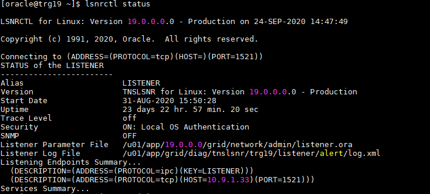
* The **HOSTNAME** will be under the "Listening Endpoints Summary", refer to screenshot
* In this example, it is 10.9.1.33

##### Service name
* This is found in  **SOURCE DATABASES** tnsnames.ora file.
```
cat $ORACLE_HOME/network/admin/tnsnames.ora
```
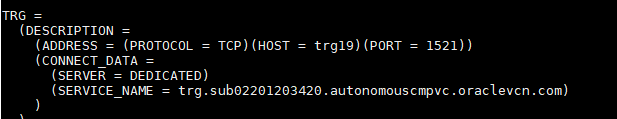

##### Test connectivity to the SOURCE databases using the connect strings
* Connect your hostname and your service name, as shown in the example below
```
sqlplus SYS/WElcome_123#@//10.9.1.33/trg.sub02201203420.autonomouscmpvc.oraclevcn.com as sysdba
```
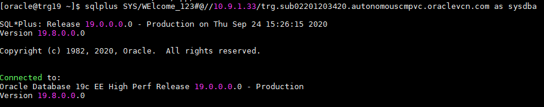


### Filling out your ADB Properties
##### ADB_NAME
This is the connect string found in your Autonomous tnsnames.ora file (credentials ZIP file). ***You do not need to add _high, it will be added automatically***

##### ADB_PASSWORD
This is the Autonomous database password in the **ENCRYPTED** format from earlier steps.

##### ADB_CFILE
This is the location of your wallet ZIP file location, in this example it is -:
```
/root/instantclient_19_8/network/admin/Wallet_T19.zip
```
<!-- If you don't have your ZIP, just sftp to your network/admin folder. !-->

### Filling out your Object Store Properties
##### OCI_NAMESPACE
This is the Oracle Cloud Infrastructure tenancy name

##### OCI_ID
This is the login username. Include your oracleidentitycloudservice if using SSO / Federation.
```
e.g.
oracleidentitycloudservice/noah.horner@oracle.com
```

##### OCI_PASSWORD
This is the **ENCRYPTED** authentication token from earlier steps.

### Screenshot of an example configuration file
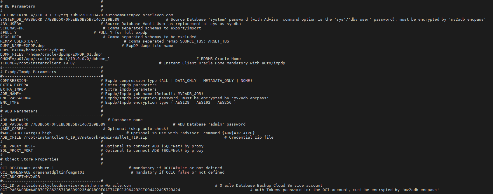

## Running the Migration Script
The migration script will export from your source databases, then import into your Autonomous database using data pump. For more information, refer to the official steps from my Oracle support (MOS) [here](https://support.oracle.com/epmos/faces/DocContentDisplay?_afrLoop=291097898074822&id=2463574.1&_afrWindowMode=0&_adf.ctrl-state=v0102jx12_4).

* Run the script in AUTO mode. ***MAKE SURE YOU ARE ROOT USER***
```
cd /opt/mv2adb
./mv2adb.bin auto -conf /opt/mv2adb/conf/DBNAME.mv2adb.cfg
```
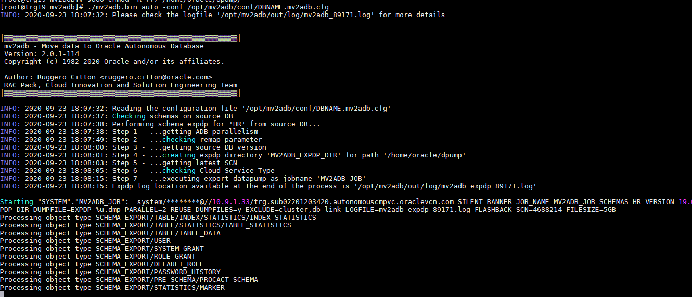
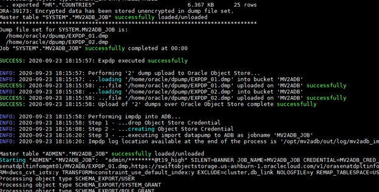

* You may run into an error regarding DBA role grants. This is normal and expected, please refer to [here](https://docs.oracle.com/en/cloud/paas/exadata-express-cloud/mgeec/import-schema-oracle-autonomous-database-1.html).
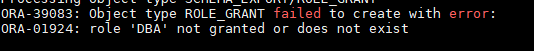

<!-- fix this ~ Humza !-->
## Validate the Data Migration
We used HR schema, but make sure you check the correct schema you used from your configuration file. If you followed lab 7, HR should be there.

```
cd /root/instantclient_19_8/
./sqlplus ADMIN/WElcome_123#@t19_high
select TABLE_NAME from all_tables where owner='HR';
```
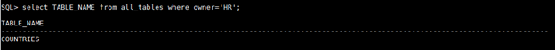


## Troubleshooting Common Issues
**Dump File errors**
* Make sure to clear out the dump file directory after each iteration.
```rm /home/oracle/dpump/* ```
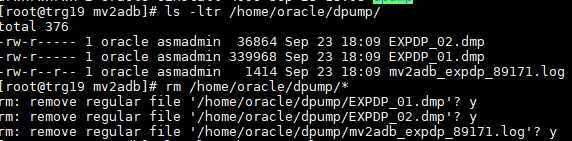

**Account Locked error**
* Switch to Oracle user, set environment (.oraenv), and unlock.
* The following commands will display all users that are locked, and how to unlock a user.
```
sqlplus / as sysdba
SELECT username, account_status, created, lock_date, expiry_date FROM dba_users WHERE account_status != 'OPEN';
ALTER USER username ACCOUNT UNLOCK
```

**Cannot Open Logfile**
* Change directory group from root to oninstall, and change permissions.
```
chown oracle:oinstall /home/oracle/dpump
chmod -R 660 /home/oracle/dpump
```
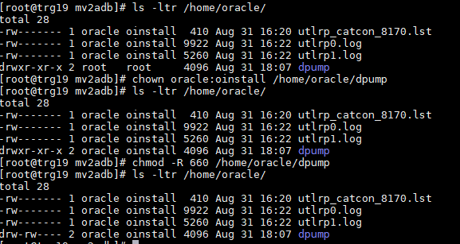

**Wrong password when connecting**
*  Verify the correct database password and auth token was encrypted. If needed, regenerate them and try again.

**Getting a unreasonable amount of errors**
* Check and verify the config file has the FULL = Y parameter commented out.

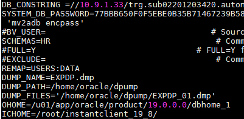

## Closing statement

- **Author** - Noah Horner & Humza Meraj
- **Last Updated By/Date** - Noah Horner & Humza Meraj September 28th, 2020.
